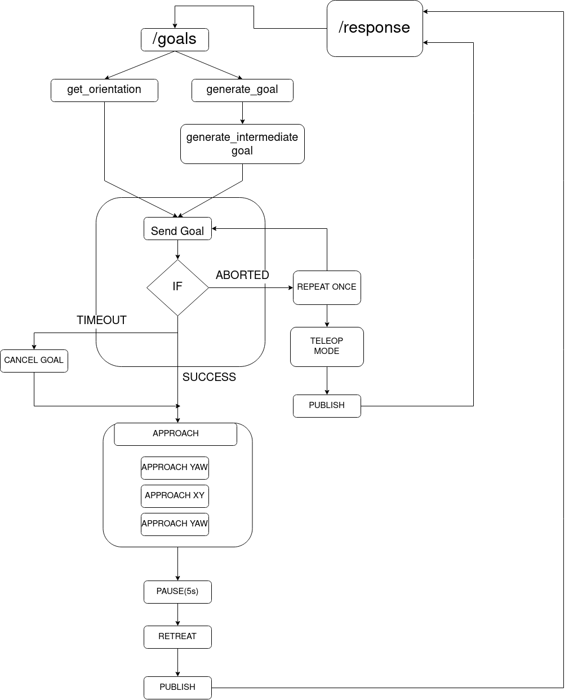

# Description

This Navigation module was implemented on a real AGV( Botsync’s Volta) and presented as a demonstration for
”Robot Navigation using Infrastructure Cameras” at the Indian Mobile Congress 2022

# Documentation for Navigation Module

## Config Params 

```
x_max : 1.6
x_min : -1.1
y_max : 1.08
y_min : -0.99 

x_max_offset : 0.3
x_min_offset : 0.2
y_max_offset : 0.2
y_min_offset : 0.2

corner_factor : 0.5

lidar_safe_dist : 0.20

shift_goal : 0.2

front_angle : 180
clearance : 120

```
### **`x_max`**,  **`x_min`**, **`y_max`** ,**`y_min`**
- ***Description*** : The x and y limits covering the furthermost boundaries of the arena 

### **`x_max_offset`**, **`x_min_offset`** ,**`y_max_offset`** , **`y_min_offset`**
- ***Description*** : The offest given along each direction from the max limits

### **`corner_factor`**
- ***Description*** : Determines the size of the corner (for 45 degree orientation). The smaller the factor the smaller the corner area. 

### **`lidar_safe_dist`**
- ***Description*** : Distance beyond which the robot will stop.

### **`shift_goal`**
- ***Description*** : Distance by which the goal will be shifted inside along the desired orientation 

### **`front_angle`**
- ***Description*** : Laser angle corresponding to the front of the robot

### **`clearance`**
- ***Description*** : Angular clearance on each side of the robot


## Class Functions 

### **`handle_goal`**
- ***Description*** : Callback to the /goals topic. Starts the sequence.

### **`movebase_client`**
- ***Description*** : Function acting as a layer between movebase action client and input goals

### **`approach_goal`**
- ***Description*** : Forward Translation as long as bot is within safe distance from boundary 

### **`retreat`**
- ***Description*** : As long as bot is within safe distance from boundary Backward Translation by 30 cm

### **`approach_yaw`**
- ***Description*** : Rotates robot to desired yaw orientation

### **`get_velocity`**
- ***Description*** : Gives velocity as a function of distance from goal

### **`get_orientation`**
- ***Description*** : Gives orientation of a goal based on where itlies with respect to the arena

- ***Depends on*** : All max limits, offsets and corner factor

- For example , Corner limit for xmax is -> corner_xmax = x_max - corner_factor * x_max_offset. Thus lower the corner_factor the smaller the corner area

### **`generate_new_goal`**
- ***Description*** : Converts invalid goal / goal inside arena to a goal on the boundary

- ***Depends on*** : Soft limits

### **`generate_intermediate_goal`**
- ***Description*** : Generates a point fixed distance away from the generated goal point along it's orientation

- ***Depends on*** : shift_goal

### **`euler_from_quaternion`**
- ***Description*** : Convert a quaternion into euler angles (roll, pitch, yaw). Ouput in radians

### **`isValid`**
- ***Description*** : Checks if goal is within soft limits 

### **`get_current_xy`**
- ***Description*** : Returns robot's current Pose

### **`laser_callback`**
- ***Description*** : Sets lidar_safe and lidar_safe_yaw to True/False

- ***Depends on*** : lidar_safe_dist 

### **`marker_publish`**
- ***Description*** : Publishes rviz marker to visualize recieved goals and converted goal

## Flowchart detailing the fallback behaviors

